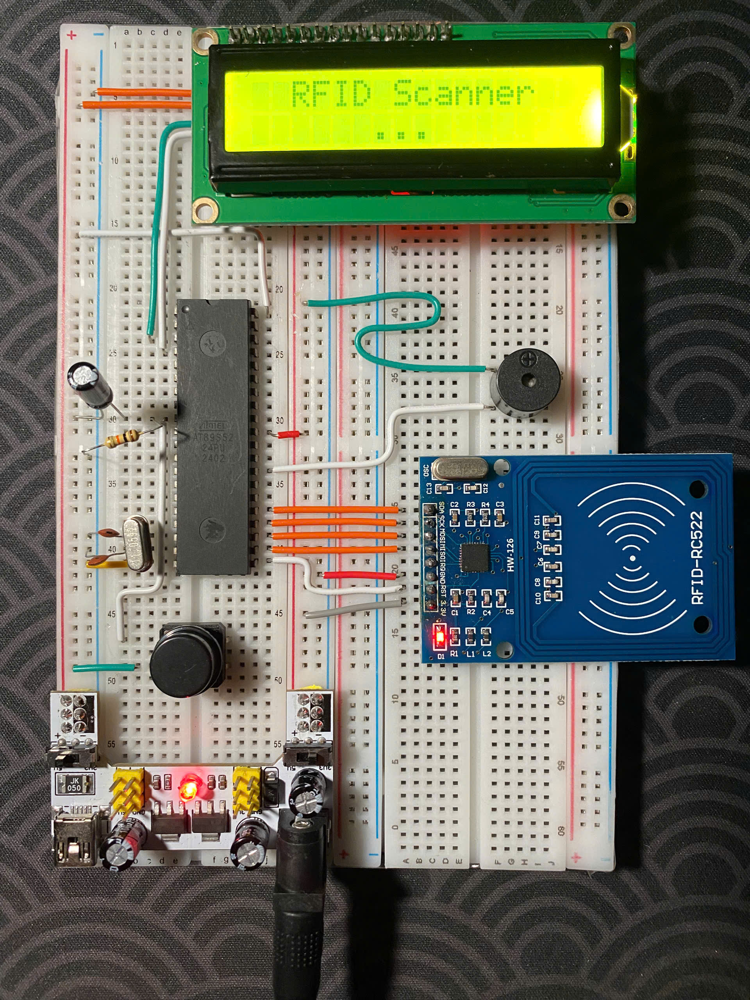

# AT89S52 RFID Interface System

This project demonstrates a simple embedded system built using the AT89S52 (8051-based) microcontroller that reads RFID tags using the MFRC522 module and displays the UID on a 16x2 I2C LCD. A buzzer provides sound feedback when a tag is detected. This system can be used as a foundation for attendance systems, access control, or inventory logging.

---

## 📌 Project Goals

- Interface the AT89S52 with an RFID reader (MFRC522) via SPI.
- Display scanned RFID UID on a 16x2 LCD using I2C communication.
- Validate UID against a predefined list and show its validity.
- Provide audible feedback with a buzzer on successful scan.
- Simulate the system in Proteus and test it on real hardware.

---

## 🧩 Hardware Components

| Component      | Description                          |
|----------------|--------------------------------------|
| AT89S52        | 8-bit microcontroller (8051 family)  |
| MFRC522        | 13.56 MHz RFID reader (SPI)          |
| 16x2 LCD       | Display module with I2C PCF8574 chip |
| Buzzer         | Audio signal feedback device         |
| Power Supply   | 5V regulated                         |
| Crystal Osc.   | 11.0592 MHz for UART compatibility   |
| 10 µF capacitor + 8.2 kΩ resistor + 30 pF             |

---

## 📐 System Overview

- **RFID Reader (MFRC522)** scans cards/tags and sends the UID to the microcontroller.
- **AT89S52** processes the UID and compares it to a valid list.
- **16x2 LCD via I2C** displays messages and UID.
- **Buzzer** gives an audible beep on each scan.

---

## 🔌 Interface Details

### LCD via I2C (PCF8574):
- SDA → P2.0  
- SCL → P2.1  
- I2C Address: `0x27` (default)

### MFRC522 via SPI (bit-banged):
- MOSI → P2.2  
- MISO → P2.1  
- SCK  → P2.3  
- CS   → P2.4  
- RST  → P2.0  

### Buzzer:
- Connected to P2.7

---

## 🖥️ Software Structure

Written in C using Keil uVision. Key modules:

- `main()` – Main loop and logic
- `mfrc522.c/h` – SPI-based MFRC522 driver
- `Thu_Vien_LCD_I2C.c/h` – I2C LCD driver
- `checkUID()` – Validates UID against predefined list
- `buzzer_beep()` – Activates buzzer for feedback

---

## 🧪 Simulation & Testing

- Simulated in **Proteus** with SPI debugger and LCD module.
- Verified functionality of SPI transactions and LCD display.
- On real hardware:
  - Scan delay ~300ms
  - Read range: 2–3 cm
  - UID shown clearly on LCD
  - Buzzer sound confirms success

---

## 📊 Limitations

- No permanent UID storage (RAM only, no EEPROM/Flash or DB).
- No security features (encryption, authentication).
- Short reading distance (MFRC522 typical range).
- No network communication (WiFi, Bluetooth, etc.).
- Manual bit-banging of SPI affects performance.

---

## 🚀 Future Improvements

- Add UID storage (EEPROM, SD card).
- Integrate real-time clock and timestamp logging.
- Improve range using better antennas or UHF RFID.
- Connect to WiFi for database sync.
- Add authentication layer (MIFARE secure access).

---

## 📷 Real Hardware circuit

*Figure 1: Fully assembled and working hardware circuit after successful testing*

### 🎬 Video Demo (Google Drive)
[Click here to watch on Google Drive](https://drive.google.com/file/d/VIDEO_ID/view)

---

## 📚 References

- MFRC522 Datasheet – NXP Semiconductors  
- SparkFun Tutorials – Serial Communication  
- Keil uVision IDE Documentation  
- RFID Application in Library Management (M.V.S.R. & Sapthagiri Colleges)

---

## 🧑‍💻 Authors

This project was created by students of UIT - University of Information Technology (CE103.P21) in May 2025.

- Nguyễn Hoàng An (Team Lead)
- Nguyễn Ngô Đình Ân
- Nguyễn Phạm Thiên Ân
- Hồ Thiện Nhân
